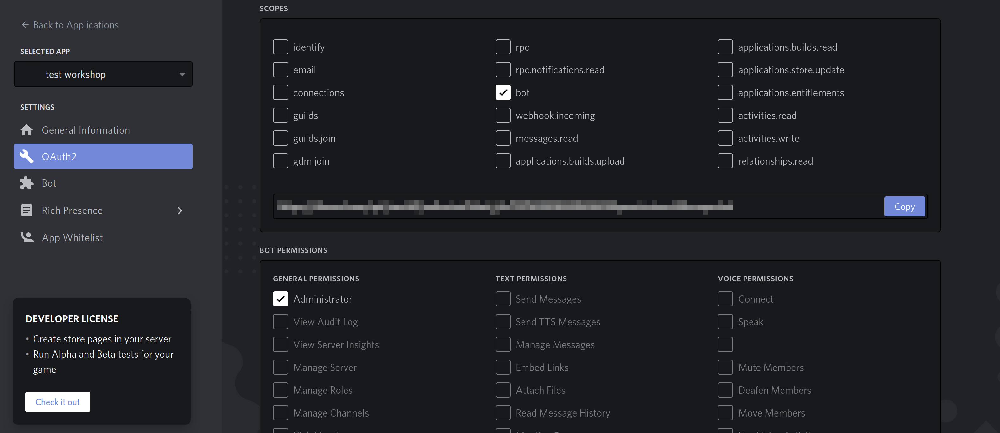

# Epitech Discord Bot Workshop - Part 0

## Some links

 What | Link
------|-------
**Discord Developper Portal**|https://discord.com/developers/applications
**Discord.js**|https://discord.js.org/#/
**Discord.js Documentation**|https://discord.js.org/#/docs/main/stable/general/welcome

## Install and setup
### Dev tools installation

For developing a Discord bot with NodeJS, you need NodeJS and Discord.js.
To install them, you can use those commands:
```bash
# nodeJS , if not installed already
sudo dnf install nodejs
# or
sudo apt install nodejs

# Create the directory and initialize it for NodeJS
mkdir discord_bot
cd discord_bot
# Just press enter until the end of the command
npm init
# Download Discord.js and opus for voice 
npm install discord.js @discordjs/opus ffmpeg-static
```

### Invitation

**We recommand that you create yourself a Discord Server dedicated to bot testing**

On Discord Developpers Portal click on New Application.

In OAuth2 tick `bot` and `Administrator` then copy and paste the link in your browser to invite your bot on your server.
*Of course, if you want to release your bot to the public, you would just select the permissions you need. But for development purposes, it's easier to have full power.*

### Run it
* Create a `index.js` file that will be our bot entry point.
You can now try this example found on the official Discord.js documentation
```node
const Discord = require('discord.js');
const client = new Discord.Client();

client.on('ready', () => {
  console.log(`Logged in as ${client.user.tag}!`);
});

client.on('message', msg => {
  if (msg.content === 'ping') {
    msg.reply('pong');
  }
});

client.login('token');
```
